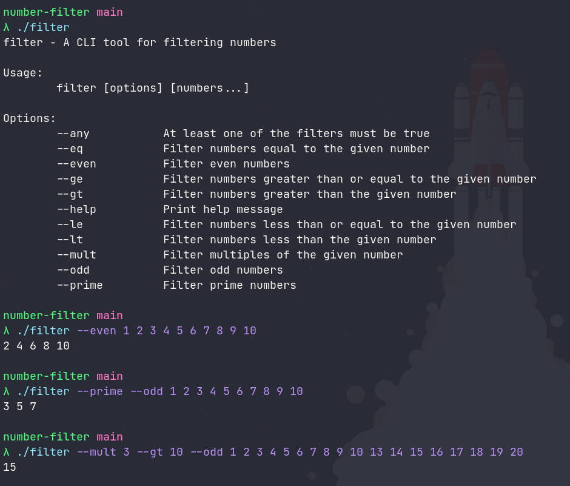

# Number filter
A CLI tool for filtering numbers built with Go.
Exercise from [Go Bootcamp](https://playbook.one2n.in/go-bootcamp).

## Build, Test, Run
```shell
make build
make test
make run
```

## Example

